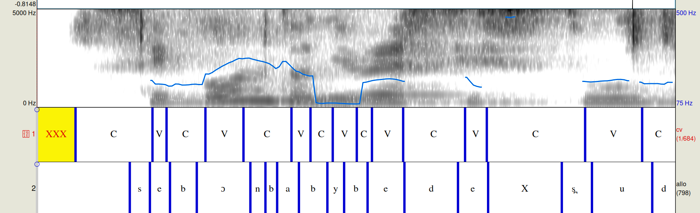
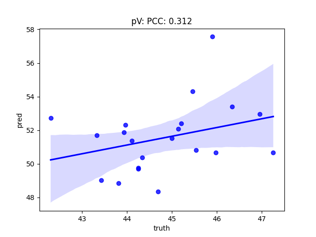
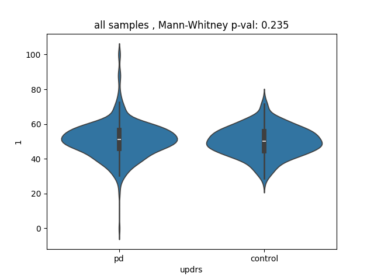
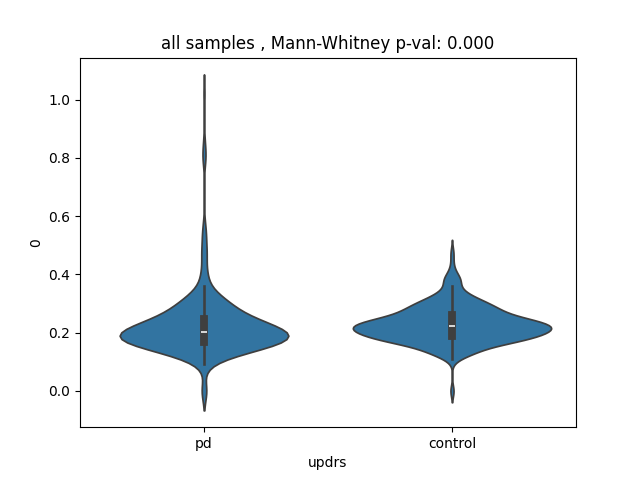

# Report: Prediction of pV and VtV

*Felix Burkhardt and Uwe Reichel, 28th July 2025*

**Aim**

Investigate the automatic prediction of parameters pV and VtV as described in the paper [*Speech Rhythm Variation in Early-Stage Parkinson's Disease: A Study on Different Speaking Tasks*](https://www.frontiersin.org/journals/psychology/articles/10.3389/fpsyg.2021.668291/full),

**Prerequisites**

* We got 21 audio files from control group with ground-truth Praat alignments of V and C.
* The audio files were not yet segmented, i.e. include speech pauses.
* The audio format was varying (mp4, ogg, wav with faulty header)

**Procedure**

1) convert all files to wav format
2) convert Praat annotations to [audformat](https://audeering.github.io/audformat/)
3) compute pV and VtV for ground-truth annotations
4) automtically transcribe all wav files to phonemes with [allosaurus](https://github.com/xinjli/allosaurus) (prediction) and assign C, V and X (for pause) from ipa table
5) compute pV and VtV for predicted annotations 
6) compare pV and VtV for groundtruth and prediction on all files
7) try the automatic pV and VtV with [Spanish Parkinson's disease data](http://www.lrec-conf.org/proceedings/lrec2014/pdf/7_Paper.pdf) (LREC 2014)

**Results**

Manual inspection of aligned truth and prediction in Praat already shows a lot of un-alignemnt.

Especially pV did not work very well, as shown in the scatter plot for VtV and pV, with low Mean Absolute Error for PV: 6.72, and VtV: 0.008.

VtV prediction is highly correlated with ground-truth:
Pearson correlation for VtV: 0.937, pV: 0.312
but, according to the paper, pV is more important.

Here's a regression plot for only pV

And here is one for vTV

I tried the features as a predictor for Parkinson's disease with the [Spanish Parkinson's disease data](http://www.lrec-conf.org/proceedings/lrec2014/pdf/7_Paper.pdf) (LREC 2014) using [nkululeko](https://github.com/felixbur/nkululeko), but, as to be expected, none of the two features was very different for PD and control.

Here are violin plots for pV:

and VtV:

# Summary

It seems the automatic extraction did not work very well, which is mostly based on the low accuracy of the allosaurus package (inspect the transription plot above).
